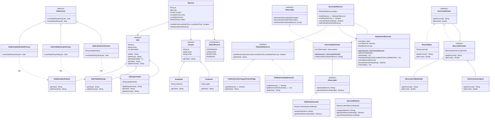

# Diagrama de Classes — Reserva de Salas de Estudo

```mermaid
classDiagram
    %% MODEL
    class Sala {
        <<abstract>>
        -String id
        -String nome
        -int capacidade
        +getId() String
        +getNome() String
        +getCapacidade() int
        +getTipo()* String
        +getDescricao()* String
    }
    class SalaEstudoIndividual {
        +getTipo() String
        +getDescricao() String
    }
    class SalaTrabalhoGrupo {
        +getTipo() String
        +getDescricao() String
    }
    class SalaLaboratorio {
        -String equipamentos
        +getEquipamentos() String
        +getTipo() String
        +getDescricao() String
    }
    Sala <|-- SalaEstudoIndividual
    Sala <|-- SalaTrabalhoGrupo
    Sala <|-- SalaLaboratorio

    class StatusReserva {
        <<enumeration>>
        CONFIRMADA
        CANCELADA
        MODIFICADA
        PENDENTE
    }

    class Usuario {
        <<abstract>>
        -String id
        -String nome
        -String email
        +getTipo()* String
    }
    class Estudante {
        -String matricula
        +getTipo() String
    }
    class Professor {
        -String siape
        +getTipo() String
    }
    Usuario <|-- Estudante
    Usuario <|-- Professor

    class Reserva {
        -String id
        -Sala sala
        -Usuario usuario
        -LocalDateTime inicio
        -LocalDateTime fim
        -StatusReserva status
        +conflitaCom(LocalDateTime, LocalDateTime) boolean
        +setStatus(StatusReserva)
    }
    Reserva --> Sala
    Reserva --> Usuario
    Reserva --> StatusReserva

    %% FACTORY METHOD
    class SalaFactory {
        <<abstract>>
        +criarSala(String,String,int)* Sala
        +criar(String,String,int) Sala
    }
    class SalaEstudoIndividualFactory {
        +criarSala(String,String,int) Sala
    }
    class SalaTrabalhoGrupoFactory {
        +criarSala(String,String,int) Sala
    }
    class SalaLaboratorioFactory {
        -String equipamentos
        +criarSala(String,String,int) Sala
    }
    SalaFactory <|-- SalaEstudoIndividualFactory
    SalaFactory <|-- SalaTrabalhoGrupoFactory
    SalaFactory <|-- SalaLaboratorioFactory
    SalaEstudoIndividualFactory ..> SalaEstudoIndividual : cria
    SalaTrabalhoGrupoFactory    ..> SalaTrabalhoGrupo    : cria
    SalaLaboratorioFactory      ..> SalaLaboratorio      : cria

    %% STRATEGY
    class PoliticaDeReserva {
        <<interface>>
        +podeReservar(Usuario,Sala,LocalDateTime,LocalDateTime,List) boolean
        +getNome() String
    }
    class PoliticaPrimeiroChegarPrimeiroPago {
        +podeReservar(...) boolean
        +getNome() String
    }
    class PoliticaPrioridadeDocente {
        +podeReservar(...) boolean
        +getReservasParaCancelar(...) List
        +getNome() String
    }
    PoliticaDeReserva <|.. PoliticaPrimeiroChegarPrimeiroPago
    PoliticaDeReserva <|.. PoliticaPrioridadeDocente

    %% OBSERVER
    class Observable {
        <<interface>>
        +adicionarObservador(Observador)
        +removerObservador(Observador)
        +notificarObservadores(Reserva, String)
    }
    class Observador {
        <<interface>>
        +atualizar(Reserva, String)
        +getUltimaReservaAlterada() Reserva
    }
    class GerenciadorEventos {
        -List~Observador~ observadores
        +getInstancia() GerenciadorEventos$
        +notificarObservadores(Reserva, String)
    }
    class NotificadorUsuario {
        -Reserva ultimaReservaAlterada
        +atualizar(Reserva, String)
        +getUltimaReservaAlterada() Reserva
    }
    class ServicoRelatorio {
        -Reserva ultimaReservaAlterada
        +atualizar(Reserva, String)
        +getUltimaReservaAlterada() Reserva
        +gerarRelatorioDiario(LocalDate)
    }
    Observable  <|.. GerenciadorEventos
    Observador  <|.. NotificadorUsuario
    Observador  <|.. ServicoRelatorio
    GerenciadorEventos o-- Observador

    %% SINGLETON
    class RepositorioReservas {
        -List~Sala~ salas
        -List~Reserva~ reservas
        -ReadWriteLock lock
        +getInstancia() RepositorioReservas$
        +adicionarSala(Sala)
        +listarSalas() List
        +listarSalasDisponiveis(LocalDateTime,LocalDateTime) List
        +salvarReserva(Reserva)
        +buscarReservaPorId(String) Optional
        +listarTodas() List
    }

    %% DECORATOR
    class ServicoAdicional {
        <<interface>>
        +getDescricao() String
        +getCusto() double
    }
    class ReservaBase {
        -String reservaId
        +getDescricao() String
        +getCusto() double
    }
    class ReservaDecorator {
        <<abstract>>
        #ServicoAdicional componente
        +getDescricao() String
        +getCusto() double
    }
    class ReservaComMultimidia {
        +getDescricao() String
        +getCusto() double
    }
    class ReservaComLimpeza {
        +getDescricao() String
        +getCusto() double
    }
    ServicoAdicional  <|.. ReservaBase
    ServicoAdicional  <|.. ReservaDecorator
    ReservaDecorator  <|-- ReservaComMultimidia
    ReservaDecorator  <|-- ReservaComLimpeza
    ReservaDecorator  o--  ServicoAdicional

    %% SERVICE
    class ServicoDeReserva {
        -PoliticaDeReserva politica
        +criarReserva(...) Optional~Reserva~
        +modificarReserva(...) boolean
        +cancelarReserva(String) boolean
        +setPolitica(PoliticaDeReserva)
    }
    ServicoDeReserva --> PoliticaDeReserva
    ServicoDeReserva --> RepositorioReservas
    ServicoDeReserva --> GerenciadorEventos
```
